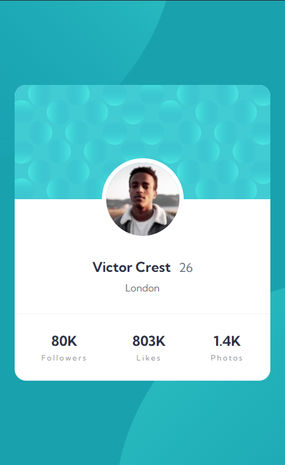
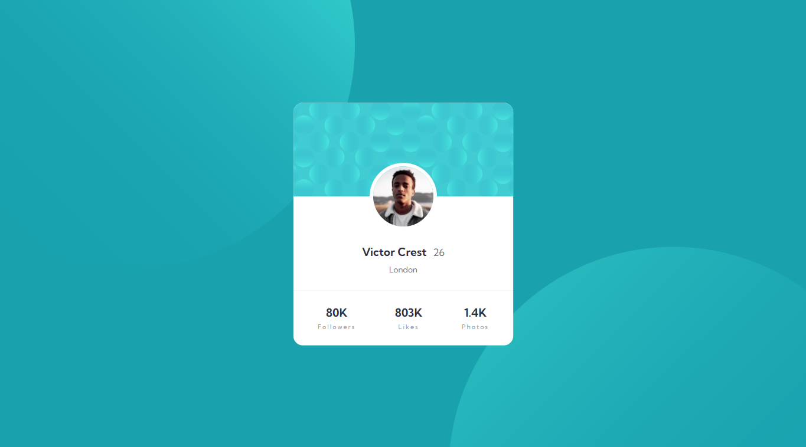

# Frontend Mentor - Profile card component solution

This is a solution to the [Profile card component challenge on Frontend Mentor](https://www.frontendmentor.io/challenges/profile-card-component-cfArpWshJ). Frontend Mentor challenges help you improve your coding skills by building realistic projects.

### Screenshot

Mobile version

Desktop version

### Links

- Solution URL: [GitHub](https://github.com/marco-moya/Profile-card-component)
- Live Site URL: [GitHub Pages](https://marco-moya.github.io/Profile-card-component)

## My process

### Built with

- Semantic HTML5 markup
- CSS custom properties
- Flexbox
- Mobile-first workflow

## Author

- Frontend Mentor - [@marco-moya](https://www.frontendmentor.io/profile/marco-moya)
